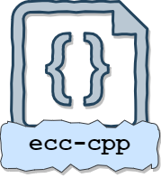

# ecc-cpp: Elliptic Curve Cryptography Library in C++

ecc-cpp is a comprehensive C++ library that implements Elliptic Curve Cryptography (ECC), providing functionalities for basic elliptic curve operations, Elliptic Curve Diffie-Hellman (ECDH), and Elliptic Curve Digital Signature Algorithm (ECDSA). This library uses the GNU Multiple Precision Arithmetic Library (GMP) for big integer operations and includes an implementation of the Blake2b cryptographic hash function.

## Features

- Basic operations on elliptic curves, including point addition and scalar multiplication.
- ECDH for elliptic curve key agreement.
- ECDSA for signing and verifying messages.
- Blake2b hash function implementation.
- Utilizes GMP for high-precision arithmetic.

## File Structure

- `include/`: Header files for the library.
  - `bigint.hpp`: Definition for big integer operations using GMP.
  - `blake2b.hpp`: Interface for the Blake2b hash function.
  - `ecc.hpp`: Definitions for elliptic curve operations.
  - `ecdh.hpp`: Interface for Elliptic Curve Diffie-Hellman (ECDH).
  - `ecdsa.hpp`: Interface for Elliptic Curve Digital Signature Algorithm (ECDSA).
- `src/`: Source files implementing the library's functionalities.
  - `bigint.cpp`: Implementation of big integer operations.
  - `blake2b.cpp`: Implementation of the Blake2b hash function.
  - `ecc.cpp`: Implementation of basic elliptic curve operations.
  - `ecdh.cpp`: Implementation of ECDH.
  - `ecdsa.cpp`: Implementation of ECDSA.
- `test/`: Test files for the library's functionalities.
- `CMakeLists.txt`: CMake configuration file.
- `Doxyfile`: Doxygen configuration file for generating documentation.

## Building the Library

To build the library, you will need CMake and GMP installed on your system. You can then follow these steps:

1. Clone the repository:
   ```
   git clone https://github.com/crypto-keys-unlocked/ecc-cpp.git
   cd ecc-cpp
   ```

2. Create a build directory and navigate into it:
   ```
   mkdir build
   cd build
   ```

3. Run CMake and build the project:
   ```
   cmake ..
   make
   ```

4. To run tests, execute:
   ```
   ./ecc-cpp_test
   ```

## Usage

After building the library, you can include the headers in your C++ project and link against the `ecc-cpp` library.

Here is a simple example demonstrating how to sign and verify a message using ECDSA:

```cpp
#include "ecdsa.hpp"
#include "ecc.hpp"
#include "bigint.hpp"

int main() {
    auto [publicKey, privateKey] = ECDH::generateKeyPair();
    std::string message = "Hello, world!";
    auto signature = ECDSA::sign(privateKey, message);
    bool isValid = ECDSA::verify(publicKey, message, signature);
    
    if (isValid) {
        std::cout << "Signature is valid." << std::endl;
    } else {
        std::cout << "Signature is invalid." << std::endl;
    }

    return 0;
}
```

For detailed documentation on each function and class, refer to the generated Doxygen documentation.

## Dependencies

- GMP (GNU Multiple Precision Arithmetic Library)
- CMake for building the project

## License

This project is licensed under the MIT License - see the [LICENSE.md] file for details.

## Contributing
Contributions to ecc-cpp are welcome. Please read [CONTRIBUTING.md] for details on our code of conduct, and the process for submitting pull requests to us.